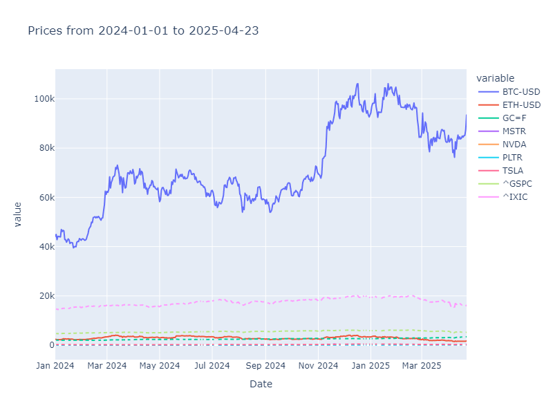
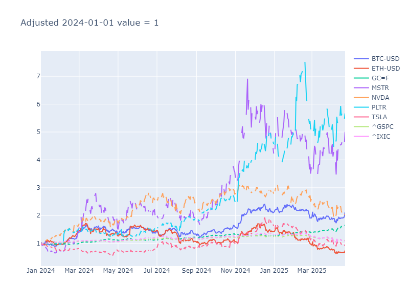

# 💸 DCA vs. Lump Sum Strategy Analyzer

## 📘 Introduction

This project provides a Python-based solution to compare two popular investment strategies — Dollar-Cost Averaging (DCA) and Lump Sum Investing — using historical asset prices. The goal is to help investors understand which approach would have yielded better returns over a selected time period.

## 🛠 Backgrounds

Investors often face the dilemma of whether to invest a large amount of money at once or to spread the investment over time. DCA involves investing a fixed amount regularly (e.g., daily or monthly), while Lump Sum means investing the entire amount at the beginning. This tool simulates both strategies and evaluates their performance using actual market data.

## 🧰 Tools used

- Python 3.8+
- Pandas – for data manipulation
- Plotly – for interactive plotting
- yfinance – for downloading historical market data
- Datetime – for handling time periods

## ❓ Questions

1. What is the total appreciation over the period and what is the average annual return?
2. Was it better to invest or to have cash in that period? And if to invest, then in one lump sum or by the DCA method?

## 📊 Analysis

The script allows users to input a list of tickers and a date range. It then:
- Downloads historical adjusted close prices
- Simulates daily $1 investments (DCA)
- Calculates key metrics: total value, units bought, % profit, and CAGR
- Normalizes prices for equalized performance comparison
- Visualizes price growth and DCA outcomes
- Recommends whether DCA or Lump Sum would have performed better

#### Example Output BTC-USD from 2024-01-01 to 2025-04-23:

```
Each dollar invested in BTC-USD daily during whole period makes 0.0070 units (658.52$), total amount invested 478$, profit is 37.77%, 1.38 times invested value, with CAGR 27.72%.
So you needed to invest 141.90$ per day to have 1 unit today, worth 93441.89$.
```

#### Example Output price action from 2024-01-01 to 2025-04-23:


*BTC-USD and ETH-USD continuous line because of trading 24/7, while the rest is dashed.*

#### Example Output adjusted price action from 2024-01-01 to 2025-04-23:


*BTC-USD and ETH-USD continuous line because of trading 24/7, while the rest is dashed.*

## 📚 What I learned

- How to simulate and compare real-world investment strategies using Python
- The impact of market timing versus consistent investing
- Building visualizations that effectively communicate financial data

## 🔎 Insights

- Lump Sum tends to outperform when markets trend upward rapidly.
- DCA reduces risk during volatile or declining markets by smoothing out entry points.
- Normalizing price data to a common baseline offers a clear way to compare assets with different scales.

## ❗ Answers

1. What is the total appreciation over the period and what is the average annual return?

- DCA invest
```
Each dollar invested in BTC-USD daily during whole period makes 0.0070 units (658.52$), total amount invested 478$, profit is 37.77%, 1.38 times invested value, with CAGR 27.72%.
So you needed to invest 141.90$ per day to have 1 unit today, worth 93441.89$.
```
- Lump sum invest
```
Today value of first trading day in our date frame is:
2.12 times of invested value for BTC-USD
Profit is:
111.56% for BTC-USD
```

2. Was it better to invest or to have cash in that period? And if to invest, then in one lump sum or by the DCA method?

```
In chosen period 2024-01-01 to 2025-04-23 it was better to:
Make a one-time purchase of BTC-USD.
```

## 🏁 Conclusion

This tool offers a clear and interactive way to assess historical investment performance for both DCA and Lump Sum strategies. It's useful for beginners exploring investing behavior, as well as for experienced users looking to analyze historical patterns. Further improvements could include support for custom investment frequencies or inflation adjustments.